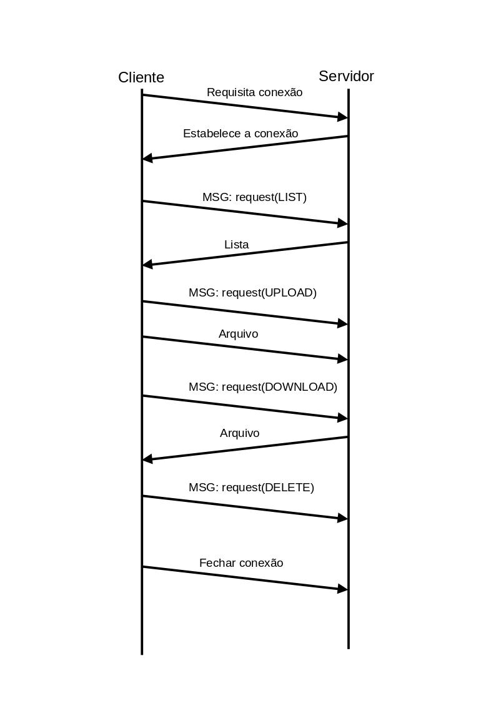

# File-Management-Client-Server

## Introdução

O software tem como objetivo simular um gerenciador de arquivos remoto simples, que facilita o gerenciamento de arquivos entre diferentes dispositivos.

O _server_ é responsavel por gerenciar as conexões dos clientes e os arquivos enviados e recebidos.
O _client_ é responsavel por se conectar ao servidor e gerenciar as mensagens de comunicação.

## Caracteristicas do software

O software permite:
- Upload de qualquer arquivo de até 10MB de um computador local para um servidor remoto;
- Download de qualquer arquivo de até 10MB do servidor remoto para o computador local;
- Listar todos os arquivos presentes no servidor;
- Excluir arquivos do servidor;

## Protocolo de transporte

O protocolo de transporte escolhido foi o TCP (Transmission Control Protocol) devido à sua confiabilidade na transmissão de dados. O TCP fornece uma conexão persistente entre o cliente e o servidor, garantindo que os dados sejam entregues sem erros, na ordem correta e sem perda. Isso é crucial para aplicações que exigem uma comunicação robusta, como transferência de arquivos e mensagens em tempo real.


## Gerenciamento de Arquivos

A aplicação utiliza as pastas específicas "files" no lado do servidor e "downloads" no lado do cliente para gerenciar arquivos durante a comunicação.

### Estrutura das Pastas

1. **Servidor (files):** A pasta "files" no lado do servidor é utilizada para armazenar os arquivos enviados pelo cliente e que podem ser baixados e/ou deletados os pelos clientes.

2. **Cliente (downloads):** A pasta "downloads" no lado do cliente é reservada para armazenar os arquivos recebidos do servidor.


## Funcionamento

### Servidor

O servidor, assim que online, começa o tratamento de conexões de clientes chamando o _handle_client_ para cada cliente novo conectado.

- A função _handle_client_ gerencia as mensagens do cliente e chama as funções designadas para cada request recebido.
- A função _upload_ gerencia o servidor para receber um arquivo do cliente.
- A função _download_ gerencia o servidor para enviar um arquivo para o cliente.
- A função _delete_ gerencia o servidor para deletar um arquivo.
- A função _list_ gerencia o servidor para enviar para o cliente uma lista dos arquivos disponiveis.

### Cliente

O cliente automaticamente se conecta no servidor configurado e abre uma interface por onde o usuario interagem com o software. A partir daí passa a gerenciar as mensagens a serem enviadas e recebidas pelo servidor.

- A função _menu_ gera a interface grafica pela qual o usuario interage com o software.
- A função _createMessage_  cria a mensagem para o servidor no formato padrão do protocolo.
  
- A função _list_ gerencia a comunicação com o servidor para obter a lista de arquivos disponiveis no servidor. 
- A função _printFiles_ exibe a lista de arquivos disponiveis no servidor na interface.
  
- A função _upload_ gerencia a comunicação com o usuario para enviar um arquivo local para o servidor remoto.
- A função _uploadFile_ gerencia a comunicação direta com o servidor para enviar um arquivo local para o servidor remoto.
  
- A função _download_ gerencia a comunicação com o usuario e a comunicação necessaria com o servidor para enviar um arquivo local para o servidor remoto.
- A função _downloadFile_ gerencia a comunicação direta com o servidor para enviar um arquivo local para o servidor remoto.
  
- A função _delete_ gerencia a comunicação com o usuario e a comunicação necessaria com o servidor para excluir um arquivo do servidor remoto.
- A função _deleteFile_ gerencia a comunicação direta com o servidor para excluir um arquivo do servidor remoto.
  
## Executando 

### Servidor

Na pasta do arquivo `server.py` digite o comando:

```
python3 server.py
```

Certifique-se de ter uma pasta junto ao arquivo chamada `files`

### Cliente

Na pasta do arquivo `client.py` digite o comando:

```
python3 client.py
```

Certifique-se de ter uma pasta junto ao arquivo chamada `download`

## Requisitos Mínimos

### Python

O software foi desenvolvido em Python, portanto, é necessário ter o interpretador Python instalado no sistema onde o servidor e os clientes serão executados. É recomendado o uso de Python 3.10+.

### Bibliotecas

- socket: Utilizado para comunicação em rede.
- threading: Utilizado para manipulação de threads.
- tkinter: Utilizado para o funcionamento da interface grafica.
- os: Utilizado para limpar o terminal (compatível com sistemas Linux e Windows).

### Configurações de Rede:

O servidor é configurado para rodar localmente na porta 5050, ou seja, no endereço IP '127.0.0.1', porta 5050.
O cliente deve ser configurado para o IP do servidor, mantendo a porta 5050.

Certifique-se de que essa porta esteja disponível e não esteja bloqueada por firewalls.
Em caso de necessidade, muda a porta do servidor e do cliente para outra, contando que fique a mesma para os dois.

### Conexão entre Servidor e Cliente:

O servidor e os clientes devem ser capazes de se comunicar pela rede. Certifique-se de que não há bloqueios de firewall ou outros obstáculos impedindo a comunicação entre o servidor e os clientes.

### Tratamento de Erros:

O software lida com a maioria dos erros possiveis mantendo as conexões enquanto possivel e mantendo sempre o servidor online.
Em casos de erros que levem a encerrar a conexão o servidor se manterá online, portanto basta conectar novamente.
Em casos de erros que impessa a transmissão de novas mensagens e novas conexões, reinicie o servidor.


# Protocolo de Aplicação Cliente-Servidor

## Estrutura das Mensagens
As mensagens são divididas em 2 tipos:
- _Requisição_: {resquest: <REQUEST>, file_name: <file_name>, file_size: <file_size>}
- _Arquivo_: uma sequencia de binario, após uma requisição, que representa os dados do arquivo terminada com uma flag 'EOF' em binario.
- _Lista_: uma sequencia de bytes que representa uma lista de arquivos.

## Mensagens

### Cliente para Servidor

#### LIST
Requisição de lista de arquivos disponiveis no servidor.  
Formato: {request: 'LIST', file_name: "", file_size: ""}

*Resposta do servidor -> _Lista_

#### UPLOAD
Requisição de enviar arquivo para o servidor.
Formato: {request: 'UPLOAD', file_name: <nome_do_arquivo>, file_size: <tamanho_do_arquivo>}

#### DOWNLOAD
Requisição de baixar arquivo do servidor.
Formato: {request: 'DOWNLOAD', file_name: <nome_do_arquivo>, file_size: ""}

*Resposta do servidor -> _Arquivo_

#### DELETE
Requisição de deletar arquivo no servidor.
Formato: {request: 'DELETE', file_name: <nome_do_arquivo>, file_size: ""}

### Servidor para Cliente

#### Arquivo
Uma sequencia de binario que representa os dados de um arquivo terminada com uma flag 'EOF' em binario.

#### Lista
Uma sequencia de bytes que representa uma lista de arquivos.

### Comunicação

#### Grafico


#### Tabela
| **Cliente**     |         **Operação**            | **Servidor** |
|:-----------:    |:---------------------------:    |:------------:|
|     ==>         |      Requisita conexão          |              |
|                 |      Estabelece conexão         |      <==     |
|     -->         |   mensagem: requisição LIST     |              |
|                 |            Lista                |      <--     |
|     -->         |  mensagem: requisição UPLOAD    |              |
|     -->         |           Arquivo               |              |
|     -->         | mensagem: requisição DOWNLOAD   |              |
|                 |           Arquivo               |      <--     |
|     -->         |  mensagem: requisição DELETE    |              |
|     -->         |        Fechar conexão           |              |


## Eventos
- Evento: Recebimento de uma Requisição:
  - Descrição: O servidor recebe uma requisição do cliente.
  - Transições possíveis:
    - Próximo Estado: Estado de destino dependendo do tipo de requisição.


- Evento: Envio da Lista de Arquivos:
  - Descrição: O servidor recebeu a requisição de envio da lista de arquivos solicitada pelo cliente.
  - Transições possíveis:
    - Próximo Estado: Estado Ocioso.
    - Ação: Envia a lista de arquivos ao cliente.
  
- Evento: Recebimento do Arquivo:
  - Descrição: O servidor recebeu a requisição de upload de um arquivo enviado pelo cliente.
  - Transições possíveis:
    - Próximo Estado: Estado de Recebimento de Arquivo.
    - Ação: Inicia o processo de recebimento do arquivo.
  
- Evento: Envio do Arquivo:
  - Descrição: O servidor recebeu a requisição de donwload de um arquivo do servidor.
  - Transições possíveis:
    - Próximo Estado: Estado de Envio de Arquivo.
    - Ação: Inicia o processo de envio do arquivo.
  
- Evento: Exclusão de Arquivo:
  - Descrição: O servidor excluiu com sucesso um arquivo solicitado pelo cliente.
  - Transições possíveis:
    - Próximo Estado: Estado Ocioso.
    - Ação: Executa a exclusão do arquivo.
  
- Evento: Erro no Processamento:
  - Descrição: O servidor encontrou um erro durante o processamento da requisição.
  - Transições possíveis:
    - Próximo Estado: Estado de Erro.
    - Ação: Trata o erro.

## Estados
#### Estado Inicial (Inicial):

- Descrição: O estado inicial antes de receber qualquer requisição.
- Transição:
  - Evento: Recebimento de uma requisição.

#### Estado Ocioso
- Descrição: O servidor está esperando receber alguma requisição.
- Transição:
  - Evento: Recebimento de uma requisição.

#### Estado de Listagem (LIST):

- Descrição: O servidor recebeu uma requisição para listar arquivos.
- Transição:
  - Evento: Envio da Lista de Arquivos.

#### Estado de Upload (UPLOAD):

- Descrição: O servidor recebeu uma requisição para upload de um arquivo.
- Transição:
  - Evento: Recebimento do arquivo.

#### Estado de Recebimento de Arquivo (RecebendoArquivo):

- Descrição: O servidor está no processo de receber um arquivo (upload).
- Transição:
    - Evento: Recebimento de uma nova requisição.

#### Estado de Download (DOWNLOAD):

- Descrição: O servidor recebeu uma requisição para download de um arquivo.
- Transição:
  - Evento: Envio do arquivo.

#### Estado de Envio de Arquivo (EnviandoArquivo):

- Descrição: O servidor está no processo de enviar um arquivo (download).
- Transição:
    - Evento: Recebimento de uma nova requisição.

#### Estado de Exclusão (DELETE):

- Descrição: O servidor recebeu uma requisição para excluir um arquivo.
- Transição:
  - Evento: Exclusão de Arquivo.

#### Estado de Erro (Erro):

- Descrição: O servidor encontrou um erro durante o processamento da requisição.
- Transição:
  - Evento: Recebimento de uma nova requisição.


